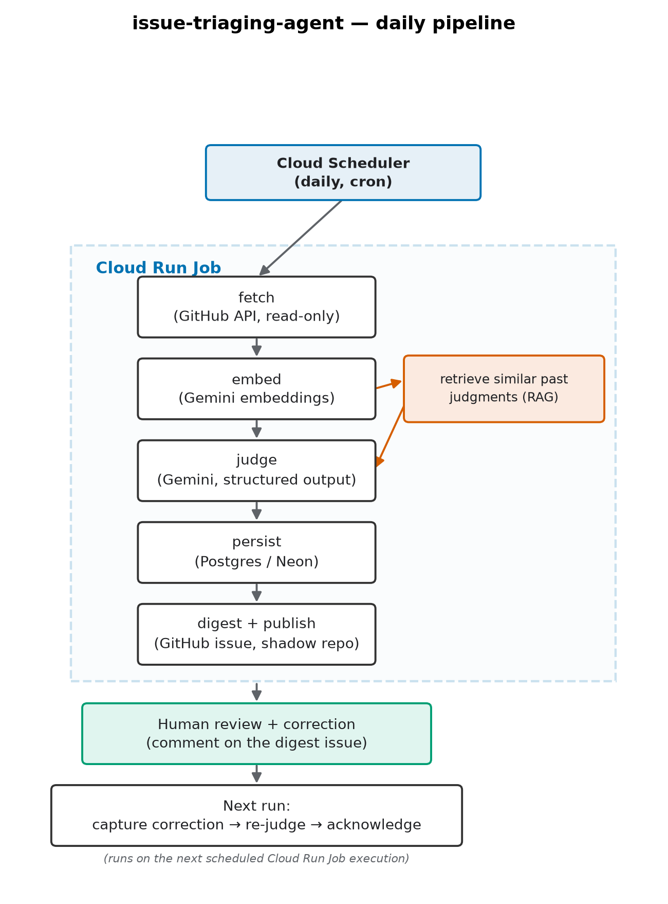

# issue-triaging-agent

An AI-assisted triage pipeline for scikit-learn's public "Needs Triage" GitHub issues.

The system fetches new issues, produces a structured judgment (label, priority, spam flag, duplicate suggestion) via an LLM, publishes a daily digest for human review, and incorporates real corrections back into future judgments.

This is a personal engineering project, not a product. It exists to produce real, independently inspectable evidence of designing, building, deploying, evaluating, and operating a production-style AI system end to end — not a demo.

## Not Affiliated with scikit-learn

**This project is not affiliated with, endorsed by, or operated on behalf of the scikit-learn organisation, Probabl, INRIA, or NumFOCUS.**

It has **read-only** access to scikit-learn's public issue data via GitHub's public API. It never comments on, labels, or otherwise writes to the scikit-learn repository.

Every generated judgement is published only to a repository the author owns ([`issue-triaging-agent-digests`](https://github.com/virchan/issue-triaging-agent-digests)), for the author's own review, never to the upstream project.

The author is also a scikit-learn contributor, but this project is separate from that work, and neither acts on behalf of the project nor its maintainers.

## The Problem

Issue triaging requires maintainers to repeatedly read new reports, identify their likely category, check for possible duplicates, detect spam, and decide what deserves attention.

Some parts of this process are deterministic, such as fetching issues, tracking state, and publishing results. Other parts depend on understanding unstructured text and are more suitable for an LLM.

This project keeps those two concerns separate:

* Deterministic code handles orchestration and state.
* LLM is used for tasks that require semantic judgement.

## What It Does and the Architecture

<center></center>

<details>
<summary><strong>Pipeline Steps in Detail (Click to Expand)</strong></summary>

| # | Step | What it does |
|---|---|---|
| 1 | **Fetch** | Fetch scikit-learn issues labelled `Needs Triage` that were created since the previous run. |
| 2 | **Judge** | Gemini produces a structured judgement containing: <ul><li>suggested label</li><li>spam flag</li><li>priority</li><li>summary</li><li>rationale</li><li>confidence</li></ul> Suggested labels are constrained against the repository's current GitHub label list. |
| 3 | **Detect possible duplicates** | Each issue is embedded and compared with a rolling two-year pool of scikit-learn issue embeddings. <br><br> The most similar issue above a minimum similarity floor is returned as a possible duplicate. It is treated as a suggestion rather than a duplicate/not-duplicate classification. |
| 4 | **Retrieve similar precedents (RAG)** | The same embedding is also used to retrieve semantically similar previously reviewed judgements. <br><br> These reviewed examples, including human corrections, are supplied to the model as few-shot context. This retrieval signal is separate from the recency-based few-shot examples used to maintain consistency across recent runs. |
| 5 | **Digest & publish** | Judgements are aggregated into a Markdown digest and published as an issue in the author's shadow repository. |
| 6 | **Human review & correction** | The author reviews the digest and can add corrections as comments. <br><br> When the digest issue is closed, those corrections are parsed and stored. Where API quota permits, a correction also triggers a new judgement using the corrected example as additional context. |

</details>

Everything from fetch through publish runs on a daily schedule (Cloud Scheduler → Cloud Run Job); a separate FastAPI service also runs as a Cloud Run Service, and exposes:

* `/health`
* `/judgments`
* `/trigger`

`/judgments` provides the judgement audit trail. `/trigger` supports an authenticated manual run.

A weekly backfill job incrementally maintains the embedding pool used for duplicate retrieval.

Deployment is handled through GitHub Actions. GCP authentication uses Workload Identity Federation rather than stored service-account keys.

## Key Design Decisions

<details>
<summary><strong>Click to Expand</strong></summary>

| Decision | Why |
|---|---|
| **Rank, don't classify, for duplicates.** | An early design assumed a similarity threshold could cleanly separate "duplicate" from "not duplicate." Real evaluation against a hand-adjudicated set of scikit-learn issue pairs (both a deterministic text-similarity heuristic and embedding cosine similarity) found no such threshold exists — genuine duplicates and unrelated pairs overlap substantially in similarity score. The system was redesigned around that finding: it surfaces the single most similar issue as a *suggestion*, never a duplicate/not-duplicate verdict. |
| **Deterministic wherever a rule can decide instead of a model call.** | All GitHub I/O, rate-limit handling, state transitions, and the decision of *whether* something needs an LLM call at all stay deterministic. The LLM is used specifically where meaning, not pattern-matching, determines correctness. |
| **Retrieval-augmented judgment, added deliberately, not by default.** | The system already had one few-shot mechanism (recent reviewed judgments, for operating consistency). A second, distinct mechanism was added specifically for issue-specific precedent: the same embeddings built for duplicate detection are reused to retrieve semantically similar *past reviewed* judgments — real retrieval feeding a real generation step, not just similarity-based cross-referencing. It's explicitly told to treat retrieved examples as heuristic, not authoritative, since the same evaluation that ruled out a clean duplicate threshold applies here too. |
| **No stored long-lived credentials.** | GCP authentication uses Workload Identity Federation exclusively; every secret (API keys, DB URL, webhook/trigger secrets) lives in GCP Secret Manager, never in a committed file. |
| **A correction loop that actually changes future behavior, not just a log.** | A human correction on a digest is parsed, recorded as the authoritative outcome for that judgment, and used to trigger a real re-judgment call — not merely stored as an audit note. |

</details>

## Evaluation

Evaluation is part of the repository rather than a separate manual process.

See:

* `eval/rubric.md` for the comparison rules
* `eval/failure_mode_matrix.md` for coverage of the current evaluation set

The golden set contains real, human-reviewed judgements. CI replays those cases against the live model and classifies each result as:

* `PASS`
* `REGRESSION`
* `NEEDS_REVIEW`

A `REGRESSION` fails CI.

`NEEDS_REVIEW` is reported without automatically failing the run. Some human corrections are free-form and do not provide a sufficiently structured target for an automated test to determine whether the new output fully satisfies the correction.

The failure-mode matrix records which cases are currently represented in the golden set and which are still missing. For example, the current set does not yet contain a real spam case or a null-label case.

The intention is to make those limitations visible rather than treating the golden set as complete.

## Operations

The system runs daily and has been maintained based on failures observed during real operation.

<details>
<summary>Examples (Click to Expand)</summary>

* a Dockerfile error that omitted scripts from the built image
* embedding-service rate limiting that caused approximately 65% of one backfill run to be lost
* a Cloud Run task timeout
* a Workload Identity Federation token expiring during a workflow
* two correction-parsing bugs found through normal review
* a stale-cache bug that caused previously reviewed issues to appear again
</details>

Each issue was diagnosed from logs, reproduced where possible, fixed, and verified against the deployed system. Regression tests were added for the corresponding failures.

<details>
<summary>Examples of Operational Visibility (Click to Expand)</summary>

* structured JSON logs compatible with Cloud Logging
* Cloud Monitoring alerts for job failures
* GCP Data Access audit logging
* CI status reports published as GitHub issues
</details>

The CI reports include information such as build results, service health checks, and live record counts so that deployment status can be inspected independently of the workflow UI.

## Tech stack

<details>
<summary><strong>Languages, frameworks, and infrastructure (Click to Expand)</strong></summary>

- Python
- FastAPI
- PostgreSQL (Neon)
- Gemini (structured output + embeddings)
- Jinja2
- GitHub Actions
- Google Cloud Run (Jobs + Service)
- Cloud Scheduler
- Cloud Monitoring
- Workload Identity Federation
- pytest

</details>

## Local development

```bash
uv sync
cp .env.example .env  # fill in GEMINI_API_KEY, DATABASE_URL, GITHUB_TOKEN, SHADOW_REPO_TOKEN
uv run python -m scripts.init_db
uv run pytest              # unit/integration suite (no external calls)
uv run pytest -m golden    # live golden-set regression suite (real Gemini calls)
uv run uvicorn app:app --reload
```

## Status

Actively operated.

The commit history, digest repository, and CI status-report issues provide the ongoing record of deployments, evaluation results, failures, and fixes.

## AI disclosure

LLM-based tools were used during architecture discussions, implementation, debugging, testing, and proofreading.

The author reviewed and verified the resulting work and is responsible for the final implementation and its remaining errors.